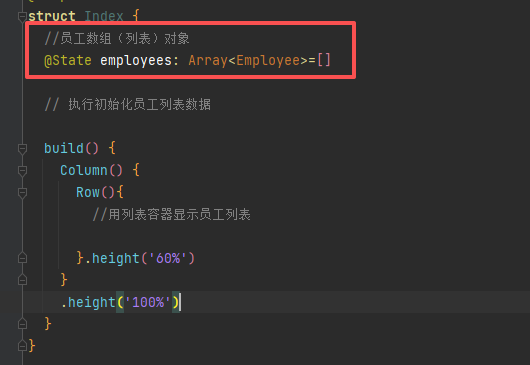

① src > main > ets > pages > Index.ets


② src > main > utils > SqliteDB.ts

```javascript
async getEmployees(){
    try {
      let employees: Array<Employee>=[]
      let sql = "select * from employees"
      await this.rdbStore.querySql(sql).then(res => {
        res.goToFirstRow()
        while (res.goToNextRow()) {
          employees.push({
            id: res.getLong(res.getColumnIndex("id")),
            name: res.getString(res.getColumnIndex("name")),
            salary: res.getLong(res.getColumnIndex("salary")),
            dept: res.getString(res.getColumnIndex("dept"))
          } as Employee)
        }
      })
    } catch (err) {
      console.log("app异常", JSON.stringify(err));
    }
}
```