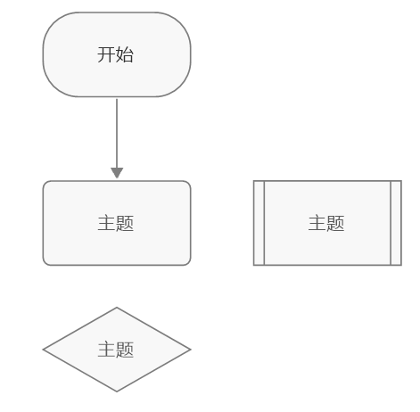
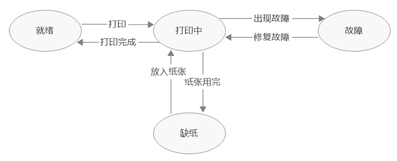
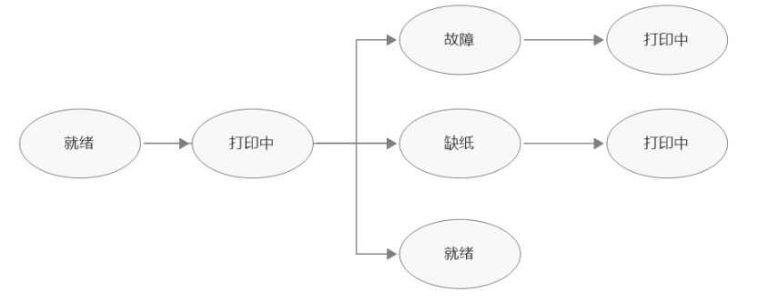
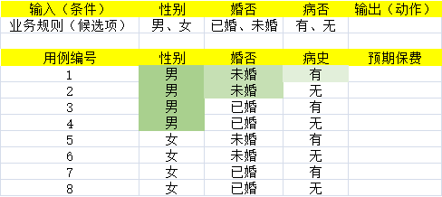
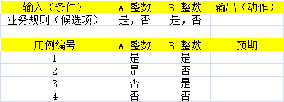
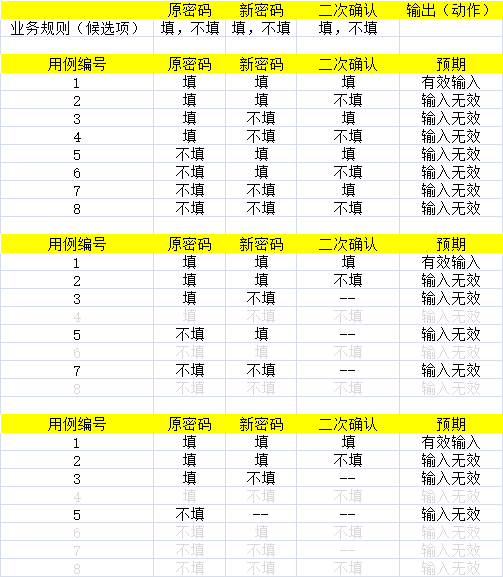

**用例设计的终极目标：提高拦截率**：何为拦截率？指所负责模块被反馈问题的情况

## 从分析到设计：用例设计

从需求中，找到**测试点**以及**约束规则**，形成大体方向的测试用例

对于各类方法的个人理解：所有的，所谓的如什么流程分析法，状态迁移图法等等的目标都是为了增加用例的覆盖范围，尽可能的减少遗漏。

## 流程分析法（P53）

用路径分析的方式来设计测试用例（翻译：根据流程的操作步骤，从而发现测试点与约束规则，进而设计测试用例）

### 流程图

圆角矩形：流程的开始/结束
矩形：流程中的工作任务/动作事件
双边矩形：子流程（衔接新流程图另行展开），比如点击取消时，由额外的弹窗对话框这样的
菱形：判断判定/条件分支
箭头：工作流方向

## 状态迁移图（P44）

使用场景：
- 有工作状态类的软件；如音乐播放器、智能洗衣机
- 有状态变化的功能；如订单、工单流转
- 流程的配置

Eg：一个打印机的状态流程

状态用**圆圈**表示

图转树

<mark>注意：箭头和状态覆盖一次即可，否则会出现一个情况，无限套娃</mark>

## 等价类划分法

等价划分，分有效、无效两类

简单的来说，**等价类划分法就是数学中的区间，区间内的，即为有效，区间外的即为无效**，

**针对同一个目标的，一条无效等价设计一条用例，不做无效与无效的排列组合**：比如上面的例子都是围绕**日期**这个测试点在做等价类划分

Eg: 直播间昵称要求6~12位，昵称包含数字、大小写字母，不含特殊字符

有效：6~12，昵称包含数字、大小写字母且不包含特殊字符
无效：
- < 6位
- \> 12 位
- 不包含数字（只有大小写字母）
- 不包含大写字母（数字+小写字母）
- 不包含小写字母（数字+大写字母）
- 含特殊字符

| 等价类型 | 等价类                                       | 编号 |
|------|-------------------------------------------|----|
| 有效   | 字符长度：[6, 12]；且昵称由不包含特殊字母的数字、大小写字母组成；  | E1 |
| 无效   | 字符长度 < 6位                                 | F1 |
| 无效   | 字符长度 > 12位                                | F2 |
| 无效   | 昵称：只有大写+小写                                | F3 |
| 无效   | 昵称：只有数字+小写                                | F4 |
| 无效   | 昵称：只有数字+大写                                | F5 |
| 无效   | 昵称：包含特殊字符、全角                              | F6 |
| 无效   | 昵称：只有数字或者小写字母或者大写字母                       | F7 |
| 无效   | 昵称：只有                                     | F8 |
| 无效   | 昵称：只有大写字母                                 | F9 |

所以根据上面的划分，在设计无效用例，如F3，昵称的测试数据，就应该为：Abcdefg，即满足字符长度，满足大小写组合，唯独不满足数字。

> 等价类划分的核心原则为**单一缺陷假设**，目的是确保测试结果的“唯一性”，即数据被判定为无效，**仅仅是因为违反了目标无效条件，而非其他因素**

另外 F7 ~ F9，可以更改为：`| 无效   | 昵称：只有数字或者小写字母或者大写字母                       | F7 |`

为什么？

因为他们属于同一类：缺少两种及以上必需元素，也就是合并了

## 边界值分析法

上点、离点、内点

上点与离点是互补的，若上点为有效值，那么离点即为无效值，反之亦然。

**边界值的运用**
规定了值的范围：
- 特别的，前50名，上点为1和50，但离点只有51，因为排名不会有第0名存在
**是一个有序的集合**
- 如12生肖的一个下拉框
**内部数据结构，选择内部数据结构边界上的作为测试用例输入数据**
- 比如一个需求规定数量上限为200的输入框，除了200之外，还有127，有可能开发用的是短整型的数据类型

**注意**：
- 等价类与边界值一般情况下，总是成对出现的
- 先等价再边界

### 输入域测试

极端测试：比如超长、超大、极小，小数的精确位数等等...;
特殊值测试：比如常见的电话号（11位，7、8位的座机号码，外卖的虚拟号码，客服号码）
场景：由业务规则的文本输入框，如电话、现金等输入

### 输出域测试
从输入结果的取值范围，倒推出测试用例

## 判定表法

- P16

将每个输入列，进行层层均分，每一列输入，均基于前一列输入的第一候选分类，按该输入的首选只数，进行均分

在复杂的多输入情况下，简介明了的不遗漏全覆盖

Eg: 计算器A+B=?，系统做了输入限制，只能输入整数

进一步，做整数范围的判定

### 判定表法用例设计的合并

## 正交试验法

定义：输入条件之间相互独立，没有相干性

优点：极大的减少组合数量，且均匀分散
缺点：与判定表相比，由遗漏的风险

