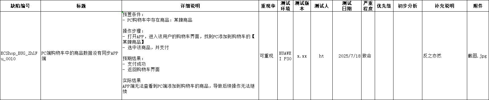

Q：编写缺陷报告的目的？

记录缺陷，帮助测试人员、开发人员管理缺陷；

## 四角色管理流程

Q：如果提交了一个缺陷，开发不认可怎么解？

测试人员发现缺陷，撰写缺陷报告
》测试组长评审缺陷，若确认缺陷，则对缺陷进行发布，若认为缺陷并非缺陷，打回给测试
》开发组长收到已发布的缺陷，对其进行评审，若确认，则分派给对应的开发；若不认可，则可能会打回缺陷；若无法确认缺陷问题或无法分派，一般情况下会挂起缺陷
》开发修复缺陷
》测试做回测测试

## 缺陷状态

New（新建）、Open（发布）、Reject（拒绝）、Postpone（挂起）、Assigned（已分派）、Fixed（已修复）、Closed（已关闭）、Reopen（重置）

## 缺陷报告

精简报告：缺陷编号、缺陷标题、详细说明、附件

**缺陷编号**：要求等同于测试用例的编号
格式：项目编号_bug_大模块_小模块_序号

**缺陷标题**：高度概括缺陷的现象，表示发现了一个什么样的错误

比如：一个用例标题为邮箱不填写的用户注册行为，预期结果为无法注册且提示邮箱必填，但测试发现邮箱不填写也能完成注册

故，正确的缺陷报告：必填项邮箱不填写也能完成用户注册

注意：用例的标题不能作为缺陷标题，因为用例的标题是不包含错误信息的

### 缺陷报告：严重程度

| 程度  | 描述                                                                           |
|-----|------------------------------------------------------------------------------|
| 致命  | 绕制软件无法运行、崩溃或造成数据永久性丢失、泄露的，或者严重影响系统安全的缺陷。 让软件完全丧失基本功能，无法满足最核心的业务需求，即为致命缺陷 |
| 严重  | 主要功能存在明显故障，或部分功能无法正常使用，严重影响用户的正常使用，系统然可以运行的，但是会对业务流程的正常进行产生较大阻碍的，即为严重缺陷。     |
| 一般  | 对软件的使用由一定的影响，但不影响主要功能和业务流程的正常运行。多是一些小的功能瑕疵或界面显示问题。                           |
| 提示性 | 也叫轻微缺陷，基本不影响软件的正常使用和功能实现，多事一些不符合良好编程规范、用户体验方面的问题。                            |

## 详细说明

需要详细描述发现该错误的过程和现象；

需要包括：预置条件、操作步骤、实际结果、预期结果

如果缺陷本身和用例没有关系，即没有经历用例操作也会发现该问题，则应该省略预置条件、操作步骤、实际结果、预期结果

## 附件

操作过程的截图或者出现缺陷时的截图

## 额外要素

- **重现概率**
- **严重程度**：表示对软件的破坏性程度；致命、严重、一般、提示性
- **初步分析**：理论上是需要的，但是一般情况下是不写的，或者在详细说明作补充说明，比如某处同样的功能没有问题，而此处有问题

## 例子

