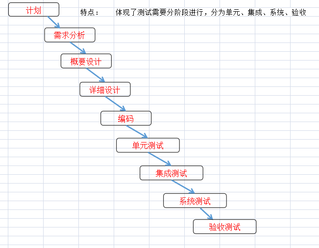
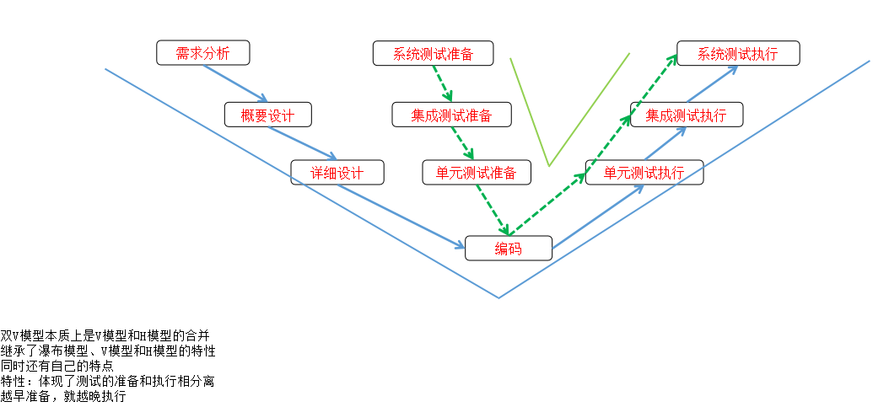

## 软测定义
IEEE对软件工程标准术语中提出如软件测试的定义:采用人工或自动化的手段，运行软件或直接观察软件的过程，其目的是检验软件是否满足用户的需求，或弄清软件和需求之间的差别。

**软件测试的方法分为**:人和自动化测试两种软测过程:
1. 观察软件运行的过程，如用户登录这一操作，输入账号，输入密码
2. 不运行软件，直接观察软件运行的过程，如查看各类文档，推测可能预见的问题

**软测的根本目的**:
1. 检验软件是否**满足用户需求**，以目标对象需求为核心前提，性能以及优化的优先级次之。
2. 检测软件与实际需求之间的差距

## 软测目的

除了检验是否满足用户需求这个根本目的之外，还可以通过软测达到其他目的。

- **为了证明**：保证软件的正常运行
    Q：为什么说是保证软件的运行？而不是保证软件的无错误性？
    A：这个世界上不存在绝对的正确，只要事物存在就一定存在缺陷，无论多么精妙的事物。如严丝合缝的衔接位置，如榫卯，只是说从人类的角度来说，眼睛看到的是严丝合缝的，但其实仍然是否缝隙存在的。
    所以，软测的目的是为了保证软件的正常运行，确认软件存在错误，不能保存软件没有错误。
- **为了检测**：检测产品的缺陷，缺陷不代表错误，还应包括可优化的缺陷
- **为了预防**：测试需求的合理性，通过各类文档判断需求的合理性，
  - 尽早测试尽早修复，避免问题延后带来的不可预见的损失
  - 根据以往相关测试经验，总结原因，如何解决，以达到避免同类问题的再次发生为目的的预防

> 对源码进行测试，称为白盒测试

## 软件的生命周期

一般情况分为6个阶段，分别是：

1. **计划阶段**
    提出总体目标，总体规划；
    进行可行性论证；
    制定计划；
2. **需求分析阶段**
    市场型产品：根据市场，目标用户群体做泛用型的需求分析
    项目型产品：根据甲方需求做针对型的需求分析
    **编写软件需求说明书**★：当各类调研完成后，总结需求形成一份最初版的需求文档。该文档的评审通过签字发布，是该项目实施过程汇总的第一个重要里程碑。
3. **设计阶段**
    概要设计：将软件产品从结构上逐层分解（分解到最小部件），描述分解后的组成部分的规格要求，以及大概的一个实现方向。敲定后,编写和评审概要设计说明书（HLD：High Level Design）
    详细设计：总的来说，就是托人买东西，具体参数信息尽可能的考虑周全，才不会购买错东西。编写详细设计说明文档（）
4. **编码阶段**
5. **测试阶段**
    单元测试：对每个单元的内部运行逻辑进行的测试，**是否满足详细设计阶段提供的详细设计说明文档。**
    集成测试：逐层组装，一边组装一边测试。针对单元之间、模块之间、子系统之间的接口进行的测试，**是否满足概要设计说明文档**。
    系统测试：针对产品整体检验是否满足用户需求的测试，不再以内部的单元作为测试目标，**是否满足需求设计说明文档**。
    验收测试：用户的使用环境千奇百怪，会遇到各类不可遇见的错误。

    - 项目型
    - 市场型
        内测（阿尔法测试）：真正意义上的内测是不会外公开的
        公测（贝塔测试）：对外公开测试
6. **运行维护阶段**
    在使用中提出改进意见，根据实际情况实施改进，周期结束。

### 分析软件生命周期的根本目的？

## 研发模式

瀑布式
迭代式

## 测试方法

- 黑盒与白盒测试定义和优缺点
- 了解其他的测试方法

针对测试依据以及测试关注点的不同，分为黑白灰三种测试方法；
针对软件是否运行软件的过程的不同，分为静态和动态测试两种方法；
针对是都使用计算机辅助达到快速批量执行测试的过程的不同，分为手动测试和自动化测试；

### 黑盒测试

将被测试对象堪称一个黑盒子，只知道规格要求，而不知道内部实现逻辑，根据规格要求进行相应的输入，检验是否产生期望输出的测试方法。

其测试对象，可以是一个系统，或者是系统中的一个部分，或者是一个单元。

总结：所谓黑盒测试即为宏观层面上的笼统测试，**所见即所得**。

**优点**：
- 操作简单
- 这是一个符合用户使用视角的测试方法，只要会使用，就能执行测试
- 对测试人员技能要求不高
- 测试工作量不大，能在较短的时间内完成产品的测试

**缺点**：
- 容易有遗漏
- 某些测试的场景过于特殊，容易导致遗漏
- 某些业务很复杂，存在很多关联业务，容易忽略关联业务的测试

#### 黑盒：举个例子进一步了解黑盒？

### 白盒测试 Openbox Testing

不再将产品是为一个黑盒子，而是将盒子打开，能看得见产品内部运行的机制，针对产品设计的内部逻辑进行测试的测试方法

是一种**逻辑驱动**的测试

总结：所谓白盒测试，即根据功能需求，是否输出期望结果的一种测试，即为白盒测试

**优点**：
- 覆盖完整
- 由于能观察到产品内部方方面面的运行逻辑，可以针对每个逻辑及进行检查，所以可以发现到产品中深层次的问题，可以覆盖到产品尽可能多的需要检查的内容。
- 可以保证产品更高的质量
- 发现到问题后修复的成本低

**缺点**：
- 对测试人员的技术能力要求相对高很多，不会设计和开发，就做不好白盒测试
- 测试工作量巨大

#### 白盒：举个例子进一步了解白盒？

### 灰盒测试

- 白 + 黑
- 即关注被测对象的整体规格要求，有关注被测对象的内部运行逻辑，所以采用的测试方法，就是灰盒测试
- 针对真题规格和内部运行逻辑的比例

### 动态测试

动态测试：
- 不直接等于黑盒测试
- 测试对象：可执行程序

### 静态测试

**静态测试**：不运行软件，直接观察软件的测试方法？？？绝大部分的静态都是白盒测试

观察对象：需求文档，各设计文档、代码

人工的静态的分析技术，叫评审，也叫同行评审

自动化进行的静态测试，叫扫描，主要针对代码格式进行扫描

### 自动化测试、手动测试

- 自动化测试：使用计算机辅助快速批量执行测试的方法
- 手工测试：需要人工手动且需要发散的测试为手工测试

Q：什么时候采用自动化测试？
A：**重复度高**，**批量操作**的**机械性操作**

## 单元测试

针对单元内部逻辑进行的测试

Q：单元？
A：软件中最细小的不可再分解的，即为单元。通常是设计和代码中的一个个函数或方法

特点：
- 明确的名称
- 独立的功能
- 输入输出参数：即便返回空，也算是
- 可以被调用

## 集成测试（组装测试）

针对小整体的外部规格，和内部单元之间的接口进行的测试

## 系统测试

将产品作为一个整体，在真实的运行环境中，针对用户需求进行的测试

## Q：单元测试、集成测试、系统测试之间的区别？P202

区别：
- 测试依据的不同
  - 单元测试的测试依据为该单元是否满足详细设计文档的要求；
  - 集成测试的测试依据为模块与接口之间是否满足概要设计文档的要求；
  - 系统测试的测试依据为整体是否满足需求文档的设计要求；
- 测试关注点的不同
  - 单元测试的关注点由详细设计文档提供，关注单元内部的数据结构、逻辑控制、异常处理等等。
  - 集成测试的关注点由概要设计文档提供，关注测试模块之间的接口和接口数据的传递关系，以及模块组合后的整体功能
    > Q：这里提到的接口是API接口的意思吗？
  - 系统测试的关注点由需求文档提供，关注整个系统相对于需求的符合度。
- 测试方法的不同
  测试方法有黑盒测试、白盒测试和灰盒测试
  - 单元测试为白盒测试
  - 集成测试为灰盒测试
  - 系统测试为黑色测试
- 测试设计方法的不同
- 测试覆盖完整性的评估标准的不同
  - 单元测试覆盖率完整性：采用**逻辑**覆盖率的评估标准
  - 集成测试覆盖率完整性：采用**接口**覆盖率的评估标准
  - 系统测试覆盖率完整性：采用**需求**覆盖率的评估标准
    > Q：逻辑、接口、需求覆盖率分别是什么意思？P184
    A：逻辑，假设用户名的注册是长度为6~11的长度，若满足则成功注册，否则视为错误输入。此为一条逻辑，若存在500个，但是只测试了50个，表示逻辑覆盖率只有10%；
      
- 测试策略的不同
  先测什么，后测什么，怎么测
  单元测试的策略（P207）：孤立的、自顶向下的、自低向上的
  集成测试的策略（P224）：大爆炸的、自顶向下的、自低向上的
  系统测试的策略：根据不同质量特性分别进行测试的策略
  > Q：质量特性又是啥？
- 测试环境的不同
  单元、集成：采用开发环境
  系统：是运行环境，用户用什么环境，测试就用什么环境；运行时还分仿真环境和真实环境
- 测试执行顺序的不同
    先单元后集成最后系统

## 阿尔法和贝塔测试

阿尔法（alpha）：极少量的用户邀请到测试环境中，在项目成员的指导和控制下进行的验收测试
贝塔（beta）：将产品开放给少量用户，由用户在真实环境中，自由进行的验收测试

用游戏举例，阿尔法为真正意思上的内测，贝塔为公测

### alpha 与 beta 区别
- 人数不同
- 环境不同
- 过程不同
- 影响不同

## 回归测试（回测）

**因为产品的修改**，而重新执行测试的测试，叫回归测试（Regression Testing）；

回归测试可以发生在任何一个测试阶段，可以采用任何测试方法；

### 回归测试的目的

1. 检验修改是否正确
2. 检验没有修改的内容是否受到了影响

### 回归测试的策略

1. 完全重复的回测策略：也就是常说的全量测试，无论修改了哪些内容，全部重新测试
2. 选择性的回测策略：只挑选一部分进行回测，其他不做回测
    - 覆盖修改法：只对修改的内容做测试，没有修改的内容不错。前提：简单的修改，比如修改一个字儿的情况下
    - 周边影响法：所谓周边是指是否会有关联性的存在，简单的来说即为牵一发动全身的，不仅仅修改的目标需要做回测，关联部分也需要做回测
    - 指标达成法：自行定义回归测试要达到的指标，按指标挑选内容进行测试

> Q：是否与测试阶段、测试方法存在联系？
> A：回测与谁都不存在直接联系

## 测试模型

根本目的是为了解释测试

瀑布模型、V模型、H模型（X模型）、双V模型（W模型）

### 瀑布模型

类似于软件生命周期的瀑布模型，将测试阶段拆分为：单元测试、集成测试、系统测试、验收测试4个阶段；

前面提到的软件生命周期中的测试阶段描述的内容就是瀑布模型

> Q：瀑布模型的作用？或者说为什么用瀑布模型？
A: 揭示了软测分阶段、按顺序执行的特性，按照先单元，接着集成，在系统，最后验收的过程

### 双V模型（W模型）

- 具有 V 和 H 模型的特性
- 具有单元、集成、系统的分阶段测试的特性
- 又区分单元测试准备和执行、集成测试准备和执行、系统测试准备和执行
- 还表示了单元测试和详细测试的关系、集成测试和概要设计的关系、系统测试和需求分析的关系；
- 揭示了软件测试的前期准备和后期执行相分离的特性，越早准备、就越晚执行
  

## 测试的4个活动

测试时需要经历的4个活动（过程）：**计划活动、设计活动、实现活动、执行活动**

计划、设计、实现统称为测试准备，和测试准备对应的是测试执行

### 测试计划活动
制定测试计划：4W
- who: 规划测试团队、明确人员职责
- where
- when
- what：测试范围、任务分解、排列计划

测试计划活动要编写一份文档，是什么文档？
测试计划文档的编写

#### 任务分解

- 明确每个任务的目标、标准、交付物
- 预估所需资源、人员

### 测试设计活动

制定测试方案的，怎么操作？

- 针对计划中的每个任务设计如何实施
- 如何搭建测试环境
- 如何分析业务、设计测试用例
- 如何准备测试数据
- 如何执行测试、记录测试结果

### 测试实现活动

主要任务：编写和评审测试用例

<mark>测试实现活动，此为重中之重</mark>

Q：为什么要编写测试用例？
A：确保测试时是充分的，如果不写，今天指导，明天知道，一个月之后呢，还能记得99%运行逻辑吗？如果不写用例，做回测时，还记得什么地方修改了吗？
其二，通过评审用例，一定程度上保证大家对软件的掌握程度在一个水平线上

流程：
由开发对测试人员进行业务培训，进行测试需求的评审；
采用思维导图分析业务，进行测试项的设计；
平身思维导图中的测试项，是否完整，是否正确；
针对每个测试项，采用七档的测试用例设计方法来设计用例；
评审用例；
如果有自动化测试的需要，还要选择自动化测试工具，编写自动化测试脚本，最后评审脚本；

### 测试的执行活动：

> Q：测试执行活动需要做哪些事情？
- 搭建测试环境
- 准备测试数据
- 执行预测试
    冒烟测试（smoking testing）:不追求测试覆盖的完整性，而只运行软件主流程、初步检验软件能否使用的测试方法。总的来说，只做主线的测试方法，不追求完整度的
- 评审预测试报告，通过则转测试
- 全面执行测试，记录测试结果
- 如果发现缺陷，则填写缺陷报告
- 定位分析缺陷，并修复缺陷（由开发完成）
- 回归测试，若发现新的问题或者问题未解决，回到缺陷报告
- 当达到测试通过标准后，结束测试，总结测试，编写测试报告

