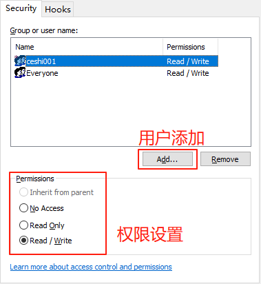

> Q: 测试工程师平时是如何使用配置管理工具的？
1. 获取文档
2. 获取被测物：开发将待测的程序文件放在SVN内，测试人员前往下载
3. 对测试文档进行配置管理：如测试计划、测试方案、测试用例

<!--more-->

> Q: 配置管理的目的？
1. 保证软件产品的完整性
2. 保证软件铲平具有可回溯性

## 版本标识

一般情况下，其格式为：**主版本号.子版本号[\.维护版本号]\[.补丁版本号]**

**主版本号**：当增加了一个大特性时
- 可能导致与原先版本不兼容；
- **产品发布前，版本号可以是0**
- **但发布的产品主办版号必须从 1 开始**

**子版本号**：增加一个小的特性时
- 保持与原先版本兼容；
- **从0开始，当主版本号升级时，子版本号要归0**

**维护版本号**：当存在更改时
- 并且包含自上一次版本发布以后所有的补丁；
- 可以**持续累加，不清0**
- 只针对内部使用，如2.0.10，若对外部使用只给2.0，当然这只是一个例子，具体情况具体分析

**补丁版本号**：解决一些客户或测试组问题
- 仅发布给报告对象，补丁也可能只是一种优化；
- 用于单个的、临时的缺陷修复

## 基线

基线，决定一个版本的范围，如果遇到回退版本，也是退回到最近的基线位置。

## 配置管理活动

配置管理的工作，主要由配置管理员负责，负责些什么？**负责搭建配置管理的环境、制定配置管理的流程和规则、配置管理活动**

其中，**配置管理活动又包含：配置计划、配置表示、配置控制、配置状态发布、配置审计**

> Q：该行为非测试人员的工作，那么有什么岗位来做这些工做呢？
1. 质量总监
2. 项目经理的心腹？？？

## 常见配置管理工具

VSS、SVN、Git

VSS: 单向道，属于串行，即我用了，你用不了
SVN：双向道，属于并行，我能用，你也能用，但提交时需提前拉去一下，防止冲突，若出现冲突，解决冲突再提交
Git：双向道，相对于SVN而言，Git是分布式处理，SVN是集中式处理，但提交时需提前拉去一下，防止冲突，若出现冲突，解决冲突再提交

## SVN

安装：

需留意安装过程中的端口设置，将 443 修改为 4430

## 配置管理员

**创建数据仓库**：
右击【Repositories】
》Create ...
》仓库名可以是中文也可以是英文
注意勾选“Create default ...”创建三个默认文件夹，可以简单的作为克隆成功的一个标识
**创建用户**：右击【Users】》Create User
**创建用户组**：
右击【Groups】
》Create New Group
》点击 Add（注意：按住Ctrl做目标选择，按住Shift做连续选择）
**创建仓库访问权限**
右击目标【仓库】
》选择：Repositories
》Security列表
》点击 Add（注意：按住Ctrl做目标选择，按住Shift做连续选择）

### 获取访问地址： 
- 新建一份TXT文档
- 右击仓库，选择 Copy ... 获取并复制到文档中：https://class023:4430/svn/HeTaoSVN310/
- Win+R: cmd 》 输入 ipconfig 并回车，获取本机IP
- 将端口号前面的内容替换为本机地址：https://172.30.196.40:4430/svn/HeTaoSVN310/

### SVN克隆仓库

- 新建一个文件夹并进入该文件
- 右击所在位置，选择 SVN Checked Out
- URL of repository: 填入地址 https://172.30.196.40:4430/svn/HeTaoSVN310/
- 点击 OK，此时会有一份警告，选择：Accept...
- 用户为该仓库中所分配的用户账号
- 等待...克隆成功
