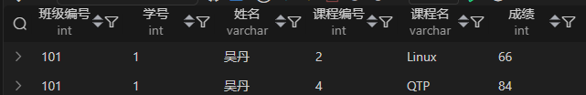
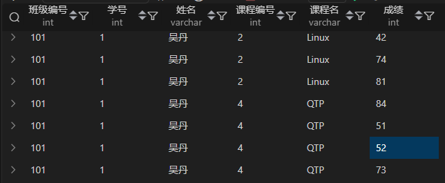

| 词汇     | 描述        |
|--------|-----------|
| 检索     | 搜索或者查询的意思 |
| 不超过100 | <=100     |
| 不小于100 | \>=100    |
| 子查询    | 指嵌套查询     |

## **1. 现在运营想要了解2021年8月份所有练习过题目的总用户数和练习过题目的总次数，请取出相应结果**

| id | device_id | question_id | result | date       |
|----|-----------|-------------|--------|------------|
| 1  | 2138      | 111         | wrong  | 2021-05-03 |
| 2  | 3214      | 112         | wrong  | 2021-05-09 |
| 3  | 3214      | 113         | wrong  | 2021-06-15 |
| 4  | 6543      | 111         | right  | 2021-08-13 |
| 5  | 2315      | 115         | right  | 2021-08-13 |
| 6  | 2315      | 116         | right  | 2021-08-14 |
| 7  | 2315      | 117         | wrong  | 2021-08-15 |

根据的示例，你的查询应返回以下结果：

| did_cnt | question_cnt |
|---------|--------------|
| 3       | 12           |

```sql
SELECT
    COUNT(DISTINCT device_id) AS did_nct,
    COUNT(question_id) AS question_cnt
FROM question_practice_detail AS qpd
WHERE qpd.date BETWEEN '2021-08-01' AND '2021-08-30'; 
```

- 聚合函数的去重：`COUNT(DISTINCT device_id)`，在函数内部使用；
- `qpd.date BETWEEN '2021-08-01' AND '2021-08-30'; `：还可以进一步得到简化
`qpd.date LIKE '2021-08-%'` 但是这是有风险的，基于数据基本不会出现天数之外的数

----

## **2. 在一张contacts表中，存储了用户的联系信息。请查询出所有符合以下条件的电话号码，并按id升序输出所有字段**

电话号码必须是 10 位数字。
电话号码的第一位不能以 0 开头。
电话号码的格式可以是连续的 10 位数字，或以-分隔的格式（如123-456-7890）。

表：contacts
| id | name    | phone_number |
|----|---------|--------------|
| 1  | Alice   | 1234567890   |
| 2  | Bob     | 0123456789   |
| 3  | Charlie | 123-456-7890 |
| 4  | David   | 123-4567-890 |
| 5  | Eve     | 9876543210   |

```sql
drop table if exists contacts;
CREATE TABLE `contacts` (
  `id`           INT         NOT NULL,
  `name`         VARCHAR(50) NOT NULL,
  `phone_number` VARCHAR(20) NOT NULL
);
INSERT INTO contacts VALUES
(1, 'Alice', '1234567890'),
(2, 'Bob', '0123456789'),
(3, 'Charlie', '123-456-7890'),
(4, 'David', '123-4567-890'),
(5, 'Eve', '9876543210');
```

根据的示例，你的查询应返回以下结果：

| id | name    | phone_number |
|----|---------|--------------|
| 1  | Alice   | 1234567890   |
| 3  | Charlie | 123-456-7890 |
| 5  | Eve     | 9876543210   |

```sql
SELECT * FROM contacts
WHERE
    phone_number REGEXP '^[1-9][0-9]{9}$'
OR  phone_number REGEXP '^[1-9][0-9]{2}-[0-9]{3}-[0-9]{4}$'
ORDER BY id ASC;
```

注意：MYSQL 中 \d 是无效的。

另外判断部分还可简化：`^[1-9][0-9]{2}-?[0-9]{3}-?[0-9]{4}` 

- `?`:前面的内容匹配0次或1次，匹配的内容是问号前的一个元素

-----------

## **3. 运营想要计算一些参加了答题的不同学校、不同难度的用户平均答题量，请你写SQL取出相应数据**

三表语句，直接复制创建相关数据表和数据；
```
drop table if exists `user_profile`;
drop table if  exists `question_practice_detail`;
drop table if  exists `question_detail`;
CREATE TABLE `user_profile` (
`id` int NOT NULL,
`device_id` int NOT NULL,
`gender` varchar(14) NOT NULL,
`age` int ,
`university` varchar(32) NOT NULL,
`gpa` float,
`active_days_within_30` int ,
`question_cnt` int ,
`answer_cnt` int 
);
CREATE TABLE `question_practice_detail` (
`id` int NOT NULL,
`device_id` int NOT NULL,
`question_id`int NOT NULL,
`result` varchar(32) NOT NULL
);
CREATE TABLE `question_detail` (
`id` int NOT NULL,
`question_id`int NOT NULL,
`difficult_level` varchar(32) NOT NULL
);

INSERT INTO user_profile VALUES(1,2138,'male',21,'北京大学',3.4,7,2,12);
INSERT INTO user_profile VALUES(2,3214,'male',null,'复旦大学',4.0,15,5,25);
INSERT INTO user_profile VALUES(3,6543,'female',20,'北京大学',3.2,12,3,30);
INSERT INTO user_profile VALUES(4,2315,'female',23,'浙江大学',3.6,5,1,2);
INSERT INTO user_profile VALUES(5,5432,'male',25,'山东大学',3.8,20,15,70);
INSERT INTO user_profile VALUES(6,2131,'male',28,'山东大学',3.3,15,7,13);
INSERT INTO user_profile VALUES(7,4321,'male',28,'复旦大学',3.6,9,6,52);
INSERT INTO question_practice_detail VALUES(1,2138,111,'wrong');
INSERT INTO question_practice_detail VALUES(2,3214,112,'wrong');
INSERT INTO question_practice_detail VALUES(3,3214,113,'wrong');
INSERT INTO question_practice_detail VALUES(4,6543,111,'right');
INSERT INTO question_practice_detail VALUES(5,2315,115,'right');
INSERT INTO question_practice_detail VALUES(6,2315,116,'right');
INSERT INTO question_practice_detail VALUES(7,2315,117,'wrong');
INSERT INTO question_practice_detail VALUES(8,5432,117,'wrong');
INSERT INTO question_practice_detail VALUES(9,5432,112,'wrong');
INSERT INTO question_practice_detail VALUES(10,2131,113,'right');
INSERT INTO question_practice_detail VALUES(11,5432,113,'wrong');
INSERT INTO question_practice_detail VALUES(12,2315,115,'right');
INSERT INTO question_practice_detail VALUES(13,2315,116,'right');
INSERT INTO question_practice_detail VALUES(14,2315,117,'wrong');
INSERT INTO question_practice_detail VALUES(15,5432,117,'wrong');
INSERT INTO question_practice_detail VALUES(16,5432,112,'wrong');
INSERT INTO question_practice_detail VALUES(17,2131,113,'right');
INSERT INTO question_practice_detail VALUES(18,5432,113,'wrong');
INSERT INTO question_practice_detail VALUES(19,2315,117,'wrong');
INSERT INTO question_practice_detail VALUES(20,5432,117,'wrong');
INSERT INTO question_practice_detail VALUES(21,5432,112,'wrong');
INSERT INTO question_practice_detail VALUES(22,2131,113,'right');
INSERT INTO question_practice_detail VALUES(23,5432,113,'wrong');
INSERT INTO question_detail VALUES(1,111,'hard');
INSERT INTO question_detail VALUES(2,112,'medium');
INSERT INTO question_detail VALUES(3,113,'easy');
INSERT INTO question_detail VALUES(4,115,'easy');
INSERT INTO question_detail VALUES(5,116,'medium');
INSERT INTO question_detail VALUES(6,117,'easy');
```
| university | difficult_level | avg_answer_cnt |
|------------|-----------------|----------------|
| 北京大学       | hard            | 1.0000         |
| 复旦大学       | easy            | 1.0000         |
| 复旦大学       | medium          | 1.0000         |
| 山东大学       | easy            | 4.5000         |
| 山东大学       | medium          | 3.0000         |
| 浙江大学       | easy            | 5.0000         |
| 浙江大学       | medium          | 2.0000         |

```sql
SELECT
    up.university
,   qe.difficult_level
,   ROUND(
        COUNT(qe.difficult_level) / COUNT(DISTINCT up.device_id)
    , 4) AS avg_answer_cnt
FROM user_profile AS up
INNER JOIN question_practice_detail AS qpd
    ON up.device_id = qpd.device_id
INNER JOIN question_detail AS qe
    ON qpd.question_id = qe.question_id
GROUP BY
    up.university
,   qe.difficult_level
;
```

### **3.1 使用隐性联结**
```sql
SELECT
    up.university
,   qe.difficult_level
,   ROUND(
       COUNT(qe.difficult_level) / COUNT(DISTINCT up.device_id)
    , 4) AS avg_answer_cnt
FROM
    user_profile AS up
,   question_practice_detail AS qpd
,   question_detail AS qe
WHERE
     up.device_id = qpd.device_id
 AND qpd.question_id = qe.question_id
GROUP BY
    up.university
,   qe.difficult_level
;
```

### **3.2 USING**
```sql
SELECT
    up.university
,   qe.difficult_level
,   ROUND(
       COUNT(qe.difficult_level) / COUNT(DISTINCT up.device_id)
    , 4) AS avg_answer_cnt
FROM user_profile AS up
INNER JOIN question_practice_detail AS qpd
    USING(device_id)
INNER JOIN question_detail AS qe
    USING(question_id)
GROUP BY
    up.university
,   qe.difficult_level
;
```
### **3.3 WITH**
```sql
WITH with_table AS(
    SELECT t1.university, t3.difficult_level, t1.device_id
    FROM
        user_profile as t1
    INNER JOIN   question_practice_detail as t2 ON t1.device_id = t2.device_id
    INNER JOIN   question_detail as t3 ON t2.question_id = t3.question_id
)
SELECT
    university
,   difficult_level
,   ROUND(
       COUNT(difficult_level) / COUNT(DISTINCT device_id)
    , 4) AS avg_answer_cnt
FROM with_table
GROUP BY
    university
,   difficult_level
;
```
多表联查注意事项：
- 别名的使用一定不要搞错了
- 字段均要给出表的出处
- 联表时，ON子句的连接桥梁一定是越全数据越正确
```sql
WITH With_2 AS(
    SELECT
        学生表.班级编号, 学生表.学号, 学生表.姓名
    ,   课程表.课程编号, 课程表.课程名
    ,   成绩表.成绩
    FROM 学生表, 成绩表, 课程表
    WHERE
        学生表.班级编号 = 成绩表.班级编号
    AND 学生表.学号 = 成绩表.学号
    AND 成绩表.课程编号 = 课程表.课程编号
)
SELECT * FROM With_2 WHERE 课程名 IN('QTP', 'Linux') AND 姓名='吴丹' AND 班级编号 = 101;
```


比如该查询，如果没有`学生表.学号 = 成绩表.学号`就会出现，如下图所示内容，一个学生一门课会有N次成绩，这显然是错误的

因此，在联表查询的时候，桥梁越详细，查询出来的信息才会越准确，能够避免联表产生的无效数据行。

## **4. 现在运营想要分别查看学校为山东大学或者性别为男性的用户的device_id、gender、age和gpa数据，请取出相应结果，结果不去重。**

考察点：UNION、OR关于去重的知识点

| id | device_id | gender | age | university | gpa | active_days_within_30 | question_cnt | answer_cnt |
|----|-----------|--------|-----|------------|-----|-----------------------|--------------|------------|
| 1  | 2138      | male   | 21  | 北京大学       | 3.4 | 7                     | 2            | 12         |
| 2  | 3214      | male   |     | 复旦大学       | 4   | 15                    | 5            | 25         |
| 3  | 6543      | female | 20  | 北京大学       | 3.2 | 12                    | 3            | 30         |
| 4  | 2315      | female | 23  | 浙江大学       | 3.6 | 5                     | 1            | 2          |
| 5  | 5432      | male   | 25  | 山东大学       | 3.8 | 20                    | 15           | 70         |
| 6  | 2131      | male   | 28  | 山东大学       | 3.3 | 15                    | 7            | 13         |
| 7  | 4321      | male   | 28  | 复旦大学       | 3.6 | 9                     | 6            | 52         |

- 数据不去重
- 要求先输出山东大学数据，再输出性别为男的数据

此时，你想到了 `OR`，但是你知道吗？OR是自动完成去重操作的。
此时，你又想到了 `UNION`。可是UNION也会做去重操作，所以要用就用`UNION ALL` 这样就不考虑去重了

```sql
SELECT device_id,	gender,	age,	gpa FROM user_profile WHERE university = '山东大学'
UNION ALL
SELECT device_id,	gender,	age,	gpa FROM user_profile WHERE gender = 'male'
;
```

## **5. 现在运营想要将用户划分为25岁以下和25岁及以上两个年龄段，分别查看这两个年龄段用户数量**

考察点：IF条件语句、CASE语句、UNION、COUNT

- COUNT：不会统计NULL值

表：user_profile

| id | device_id | gender | age | university | gpa | active_days_within_30 | question_cnt | answer_cnt |
|----|-----------|--------|-----|------------|-----|-----------------------|--------------|------------|
| 1  | 2138      | male   | 21  | 北京大学       | 3.4 | 7                     | 2            | 12         |
| 2  | 3214      | male   |     | 复旦大学       | 4   | 15                    | 5            | 25         |
| 3  | 6543      | female | 20  | 北京大学       | 3.2 | 12                    | 3            | 30         |
| 4  | 2315      | female | 23  | 浙江大学       | 3.6 | 5                     | 1            | 2          |
| 5  | 5432      | male   | 25  | 山东大学       | 3.8 | 20                    | 15           | 70         |
| 6  | 2131      | male   | 28  | 山东大学       | 3.3 | 15                    | 7            | 13         |
| 7  | 4321      | male   | 26  | 复旦大学       | 3.6 | 9                     | 6            | 52         |

预期的查询结果：

| age_cut | number |
|---------|--------|
| 25岁以下   | 4      |
| 25岁及以上  | 3      |

### **5.1 方案一: CASE**
```sql
SELECT
    CASE 
        WHEN age<25 OR age IS NULL OR age='' THEN '25岁以下'  
        ELSE '25岁及以上'
    END AS 'age_cut'
,   COUNT(device_id)
FROM user_profile
GROUP BY age_cut;
```

### **5.2 方案二: IF**
```sql
SELECT
    IF(age>=25, '25岁及以上', '25岁以下') AS age_cut,
    COUNT(*) AS number
FROM user_profile
GROUP BY age_cut;
```

### **5.3 方案三：UNION**
```sql
SELECT
    '25岁以下' AS age_cut,
    COUNT(device_id) AS number
FROM
    user_profile
WHERE
    age < 25 OR age IS NULL OR age=''
UNION
SELECT
    '25岁及以上' AS age_cut,
    COUNT(device_id) AS number
FROM
    user_profile
WHERE
    age >= 25
;
```

## 6. 现在运营想要查看用户在某天刷题后第二天还会再来刷题的留存率。请你取出相应数据。

**考察点**：`JOIN`、`WITH`、`COUNT`、`日期函数`

[点击前往牛客网：SQL 入门篇.29](https://www.nowcoder.com/practice/126083961ae0415fbde061d7ebbde453?tpId=199&tqId=1975681&sourceUrl=%2Fexam%2Foj%3FquestionJobId%3D10%26subTabName%3Donline_coding_page)

> 数据

| id  | device_id | question_id | result | date       |
|-----|-----------|-------------|--------|------------|
| 1   | 2138      | 111         | wrong  | 2021-05-03 |
| 2   | 3214      | 112         | wrong  | 2021-05-09 |
| 3   | 3214      | 113         | wrong  | 2021-06-15 |
| 4   | 6543      | 111         | right  | 2021-08-13 |
| 5   | 2315      | 115         | right  | 2021-08-13 |
| 6   | 2315      | 116         | right  | 2021-08-14 |
| 7   | 2315      | 117         | wrong  | 2021-08-15 |
| 8   | 3214      | 112         | wrong  | 2021-05-09 |
| 9   | 3214      | 113         | wrong  | 2021-08-15 |
| 10  | 6543      | 111         | right  | 2021-08-13 |
| 11  | 2315      | 115         | right  | 2021-08-13 |
| 12  | 2315      | 116         | right  | 2021-08-14 |
| 13  | 2315      | 117         | wrong  | 2021-08-15 |
| 14  | 3214      | 112         | wrong  | 2021-08-16 |
| 15  | 3214      | 113         | wrong  | 2021-08-18 |
| 16  | 6543      | 111         | right  | 2021-08-13 |

> 根据示例，你的查询应返回以下结果：

| avg_ret |
|---------|
| 0.3000  |

整体上是求平均值，那么只需找到第一天刷题了且第二天来刷题的数据行就成

```sql
# 方案一：
WITH w_01 AS (
    SELECT COUNT(DISTINCT t2.device_id, t2.`date`) cn1
    FROM question_practice_detail AS t1
    LEFT JOIN question_practice_detail AS t2 USING(device_id)
    WHERE t1.device_id=t2.device_id AND DATEDIFF(t2.`date`, t1.`date`)=1
), w_o2 AS (
    SELECT COUNT(DISTINCT device_id, `date`) cn2
    FROM question_practice_detail AS t3
)
SELECT cn1/cn2 FROM w_01 JOIN w_o2

# 方案二：
SELECT COUNT(q2.device_id) / COUNT(q1.device_id) AS avg_ret
FROM (SELECT DISTINCT device_id,date FROM question_practice_detail) AS q1
LEFT JOIN (SELECT DISTINCT device_id,date FROM question_practice_detail) AS q2
   ON q1.device_id = q2.device_id AND q2.date=date_add(q1.date, INTERVAL 1 DAY)
;
```

- INTERVAL 1 DAY：间隔1天
- DATEDIFF(t2.`date`, t1.`date`)：日期差值，返回指为数字，也可用`TIMESTAMPDIFF()`

> Q：什么时候用JOIN、LEFT、RIGHT 和 FULL OUTER JOIN？

## 7. 查找字符串中逗号出现的次数


    SELECT id, LENGTH(REGEXP_REPLACE(string, '[0-9a-zA-Z]', '')) AS cnt FROM strings;
    SELECT id, LENGTH(REGEXP_REPLACE(string, '[0-9a-zA-Z]+', '')) AS cnt FROM strings;
    # 这里是等价的，replace 会逐个匹配并替换

题目来源：[点击前往](https://www.nowcoder.com/share/jump/1571640021754911340014)


## 7. USING 的使用

> EG: 请你查找各个部门当前领导的薪水详情以及其对应部门编号dept_no，输出结果以salaries.emp_no升序排序，并且请注意输出结果里面dept_no列是最后一列

表名：薪水表salaries
| emp_no | salary | from_date  | to_date    |
|--------|--------|------------|------------|
| 10001  | 88958  | 2002-06-22 | 9999-01-01 |
| 10002  | 72527  | 2001-08-02 | 9999-01-01 |
| 10003  | 43311  | 2001-12-01 | 9999-01-01 |

表名：各个部门的领导表dept_manager
| dept_no | emp_no | to_date    |
|---------|--------|------------|
| d001    | 10001  | 9999-01-01 |
| d002    | 10003  | 9999-01-01 |

查询结果如下，请用SQL还原
| emp_no | salary | from_date  | to_date    | dept_no |
|--------|--------|------------|------------|---------|
| 10001  | 88958  | 2002-06-22 | 9999-01-01 | d001    |
| 10003  | 43311  | 2001-12-01 | 9999-01-01 | d002    |

```sql
SELECT *
FROM salaries
INNER JOIN dept_manager USING(emp_no, to_date)
ORDER BY emp_no ASC
;
```
主要考察USING构建桥梁后，字段去哪里了的一个问题。如上：`USING(emp_no, to_date)`，

> Q：那么现在，请问emp_no, to_todate 在合并后的表中，处于第一，第二字段还是字段位置不变？

A：你可能会认为连接后字段了自然而然就会是`emp_no | salary | from_date  | to_date | dept_no`，那么你就打错特错的了，
因为`USING`会将字段提前，按照`USING`中的书写顺序排序：emp_no | to_date | salary | from_date | dept_no

## 8. 多层嵌套子查询

![嵌套子查询][嵌套子查询]

**题目明确要求不使用`ORDER BY`**

```sql
SELECT emp_no, salary, last_name, first_name
FROM employees
INNER JOIN salaries USING(emp_no)
WHERE salary=(
    SELECT MAX(salary) FROM salaries
    WHERE salary<(SELECT MAX(salary) FROM salaries)
)
```


[嵌套子查询]: https://fdc-four.oss-cn-beijing.aliyuncs.com/images/SQL/SQL-%E5%B5%8C%E5%A5%97%E5%AD%90%E6%9F%A5%E8%AF%A2-%E4%B9%A0%E9%A2%9801-%E5%A4%9A%E5%B1%82%E5%B5%8C%E5%A5%97.jpg?Expires=1754838362&OSSAccessKeyId=TMP.3Ksgkf6kGuT2T6TbNB1FnE38j6hUscNg1omqkjZYj9Nj4UKxqAeTNNqcmSLYaMqisNhAJzHvekfCHVWVaY8N8anmqk4YHc&Signature=FdXUfjvvVU4KSoal5Lz2VEtkvpg%3D
